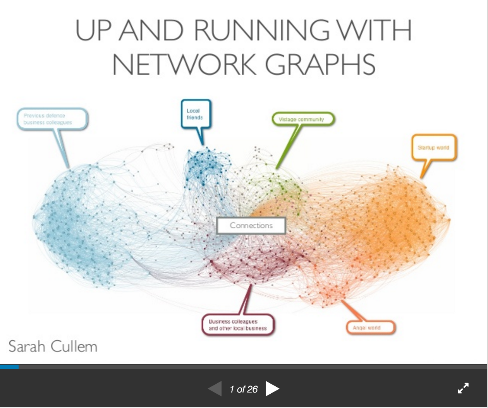

# Overview:

Network graphs, historically used predominantly in scientific research, have many applications in exploring business data from visualizing market basket analysis, to social networks, to the flow of information across systems. Although graph theory has many layers of complexity, with a basic understanding of the terminology and the use of open source tools, getting started using network graphs for exploratory analysis has never been more accessible.

The presentation below provides an introduction to using network graphs, providing an example of how using them to explore a congressional voting dataset from the 1980s (with open source tool Gephi) can reveal insights about complex relationships in the data. 

The code for accessing and preparing data for Gephi in the congressional voting example can be found in the file: [gephi_congressional_votes.ipynb](https://github.com/scullem/network_graphs/blob/master/gephi_congressional_votes.ipynb)  

See the full presentation below for an overview of getting started with network graphs:

<iframe src="//www.slideshare.net/slideshow/embed_code/key/pTIrSX4iaLVPFJ" width="595" height="485" frameborder="0" <iframe src="//www.slideshare.net/slideshow/embed_code/key/tBC1uinDt4y9TF" width="595" height="485" frameborder="0" marginwidth="0" marginheight="0" scrolling="no" style="border:1px solid #CCC; border-width:1px; margin-bottom:5px; max-width: 100%;" allowfullscreen> </iframe> 
 <strong> <a href="//www.slideshare.net/scullem/network-graph-scullem-58106703" title="Network graph scullem" target="_blank">Network graph scullem</a> </strong> from <strong><a href="//www.slideshare.net/scullem" target="_blank">Sarah Cullem</a></strong> 

# Resources
* NetworkX python: https://networkx.github.io/
* NetworkX tutorial: https://github.com/sarguido/networkx-tutorial
* Gephi download: https://gephi.org/
* Sebastien Heymann Exploratory Network Analysis with Gephi Part 1: https://www.youtube.com/watch?v=Y7Ah6VylIak
* Gephi guides: http://meta-guide.com/videography/100-best-gephi-videos
* Graph Analysis and Visualization: Discovering Business Opportunity in Linked Data:  http://www.amazon.com/Graph-Analysis-Visualization-Discovering-Opportunity-ebook/dp/B00T1JQUQE
